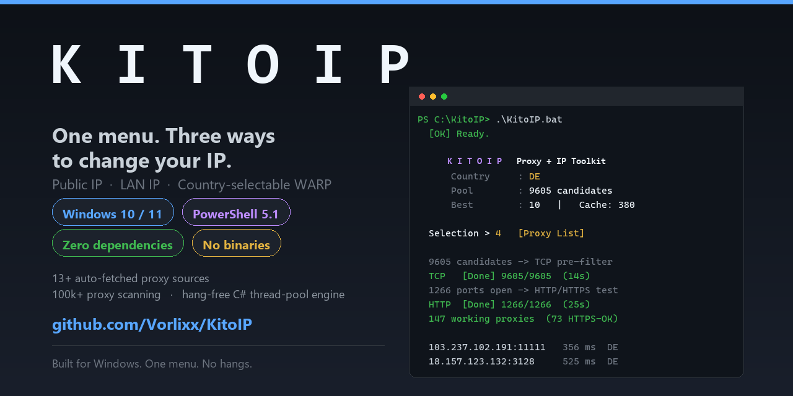
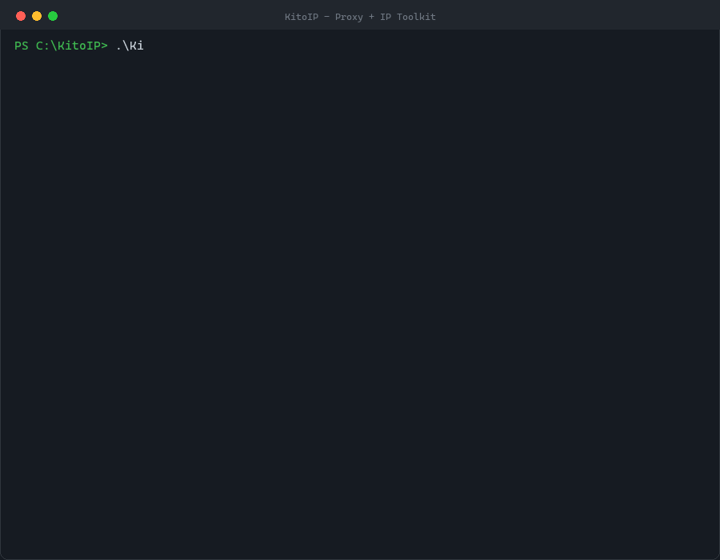

<div align="center">



# KitoIP

**One terminal. Three ways to change your IP on Windows.**
Change your **public IP** (proxy engine), your **local IP** (LAN), or your **VPN exit country** (Cloudflare WARP) — from a single menu.

[](https://github.com/Vorlixx/KitoIP)
[](https://github.com/Vorlixx/KitoIP)
[](https://github.com/Vorlixx/KitoIP/releases)
[](https://github.com/Vorlixx/KitoIP/releases)
[](LICENSE)
[](https://github.com/Vorlixx/KitoIP/stargazers)

[](#requirements)
[](#-security--trust)
[](#-author)

[Quick start](#-quick-start) • [Features](#-features) • [Comparison](#-how-it-compares) • [Security](#-security--trust) • [FAQ](#-faq)

</div>

---

## ⚡ What it is

KitoIP is a **single launcher, single menu** Windows toolkit for switching the IP your machine appears as. It does three independent jobs — no compiler, no installer, no Python, no Node.js, no NuGet:

| Capability | What it does | Elevation |
|:---|:---|:---:|
| 🌍 **Proxy engine** | Finds the lowest-latency working proxy for a chosen country and applies it as your system proxy | None |
| 🏠 **LAN IP engine** | Changes the local IPv4 address of the active adapter (DHCP renew or random static) | Admin (UAC) |
| 🔐 **WireGuard / WARP** | Registers a free account-free Cloudflare WARP identity and opens a WireGuard tunnel to a country you pick | Admin (UAC) |

> ⚠️ Changing your **LAN** IP does not change your **public** IP. Use the proxy engine or WARP for that.

<!-- The animation below is rendered from a real capture of the menu and the read-only modes. -->
<div align="center">

</div>

---

## 🚀 Quick start

**You do not need a proxy list to start.** KitoIP pulls fresh candidates from public proxy sources by itself.

```bat
git clone https://github.com/Vorlixx/KitoIP.git
cd KitoIP
```

Then **double-click `KitoIP.bat`** — or from a terminal:

```powershell
powershell -NoProfile -ExecutionPolicy Bypass -File KitoMenu.ps1
```

1. Pick **[3] Proxy Hunt** once. With no `proxies.txt` it automatically fetches from ~13 public sources, TCP-pre-filters everything, then HTTP/HTTPS-verifies the survivors.
2. After that, use **[2] Fast Connect** — it connects in seconds from cache without re-scanning.
3. **[5] Select Country** if you want a specific exit country (`DE`, `NL`, `US`, `GB`, `FR`, `RU`, `SG`, `Random`, `ALL`, or a comma-separated list).

Want a bigger pool? Drop your own `ip:port` entries into `proxies.txt` (100,000+ lines are fine) and run **[3]** again.

<details>
<summary><b>Install with a package manager (coming soon)</b></summary>

```powershell
# Scoop
scoop bucket add kitoip https://github.com/Vorlixx/scoop-bucket
scoop install kitoip

# winget
winget install Vorlixx.KitoIP
```

Scoop bucket and winget manifest submission is planned (see the Roadmap below). Until then, grab the ZIP from [Releases](https://github.com/Vorlixx/KitoIP/releases).

</details>

---

## 🖥️ The menu

```
============================================================
    K I T O I P     Proxy + IP Toolkit
============================================================
      Country     : DE
      Pool        : 102345 proxies (proxies.txt)
      Best        : 60   |   Cache: 246
      Active proxy: 185.200.188.234:10001  RU/Russian Federation  533 ms

    [1]  Connect to a Foreign IP   (country filter + lowest ms)
    [2]  Fast Connect             (from cache, in seconds)
    [3]  Proxy Hunt               (rebuild the best list)
    [4]  Proxy List               (show the fastest candidates)
    [5]  Select Country

    [6]  Proxy Off                (back to normal connection)
    [7]  Status

    [8]  Change LAN IP
    [9]  WireGuard WARP VPN
    [P]  Manage Proxy List        (bulk import / clear cache)
    [0]  Exit
```

<details>
<summary><b>Menu option details (click to expand)</b></summary>

### `[1] Connect to a Foreign IP`
Finds proxies matching the country filter and applies the **lowest-latency** one. Every candidate is verified working *before* it is applied; if it fails, the next one is tried.

### `[2] Fast Connect` *(recommended for daily use)*
Downloads nothing. Picks up to 400 candidates spread across your whole pool from the cache, `proxies_best.txt`, and your own list, then connects in ~10 seconds.

### `[3] Proxy Hunt`
Scans the entire pool — including **~13 remote sources fetched automatically** — and writes the best `TopN` proxies to `proxies_best.txt` and the cache. Designed for 100,000 proxies. Takes a few minutes.

### `[4] Proxy List`
Changes **no system settings** — it only prints the fastest candidates as a table. This is the safe way to test your pool.

### `[5] Select Country`
Accepts `Random` / `ALL` / `DE` / `NL` / `US` / `GB` / `FR` / `RU` / `SG`, a comma-separated multi-selection, or any country code you type. Remembered in `kito_settings.json`.

### `[6] Proxy Off`
Removes the system proxy and restores your normal connection.

### `[7] Status`
Shows the system-proxy state, the active proxy, and your current public IP with its country.

### `[8] Change LAN IP`
DHCP renew, random static IP from the subnet, a manual address, or back to automatic.

### `[9] WireGuard WARP VPN`
Install the WireGuard client, register a free WARP account, scan endpoints, bring the tunnel up/down, and check the exit IP. Country selection included — the official WARP client does not offer this.

### `[P] Manage Proxy List`
Bulk-imports a large list from a file. Accepted formats: `ip:port`, `ip:port:user:pass`, `http://ip:port`, `https://user:pass@ip:port`, or any text that merely *contains* an `ip:port`. Matches are de-duplicated.

</details>

---

## ✨ Features

- 🎯 **One launcher, one menu.** No more juggling a dozen `.bat` files.
- 🚀 **Never hangs.** The scanning engine (`KitoCore.ps1`) runs in real C# threads with hard deadlines — a single dead proxy can no longer freeze the UI.
- 📈 **Scales to 100,000+ proxies.** Fixed worker pool + `ConcurrentQueue`.
- 🔎 **Zero-config candidate gathering.** Pulls from ~13 public proxy sources so a fresh clone works without you supplying a list.
- 🌐 **Country selection.** `Random`, `ALL`, or `DE`, `NL`, `US`, `DE,NL,US`, … remembered between runs.
- ⚡ **Fast mode.** Connects in seconds from cache without re-scanning.
- 🔐 **Account-free WARP.** A free WARP identity is generated locally; no email, no credit card, no sign-up.
- 🛡️ **Safe by default.** `List` mode changes nothing; if an operation fails, the previous network configuration is restored automatically.
- 🧾 **Plain-text source.** Every file is a readable `.ps1` / `.bat`. Nothing is compiled, packed, or obfuscated.
- 🪶 **Zero dependencies.** Windows PowerShell 5.1 ships with Windows 10/11. WireGuard is installed on demand — only for the WARP module.

---

## 🧰 Requirements

- **Windows 10 / 11** (PowerShell 7+ also works via `pwsh`)
- **Windows PowerShell 5.1** — built in, no install needed
- **WireGuard for Windows** — only for the WARP module; installed automatically if missing
- No NuGet, pip, npm, or .NET SDK dependencies

**Admin rights:** only for `[8] Change LAN IP` and `[9] WireGuard WARP VPN`. Applying a system proxy writes to `HKCU` and needs no elevation.

---

## 💻 Command-line usage

Every mode is available without the menu:

```powershell
# Rebuild the best list (scans a 100k pool + remote sources)
.\KitoVPN.ps1 -Mode Hunt -Country ALL -TopN 100

# Connect to the lowest-latency proxy in a country
.\KitoVPN.ps1 -Mode Foreign -Country DE

# List only — changes nothing on your system
.\KitoVPN.ps1 -Mode List -Country DE

# Current state and public IP
.\KitoVPN.ps1 -Mode Status

# Back to the normal connection
.\KitoVPN.ps1 -Mode Clear

# Read-only engine self-test (changes nothing) — good first smoke test
.\KitoMotorTest.ps1
```

| Parameter | Default | Notes |
|---|---|---|
| `-Mode` | `Foreign` | `Foreign` / `Fast` / `Hunt` / `List` / `Status` / `Clear` |
| `-Country` | `Random` | `Random` / `ALL` / `DE` / `DE,NL,US` |
| `-TcpTimeoutMs` | `900` | TCP pre-filter timeout (ms) |
| `-TcpWorkers` | `768` | TCP concurrency |
| `-MaxScanTcp` | `0` | TCP candidates to scan (0 = all) |
| `-MaxTest` | `3000` | HTTP candidates to test (0 = all) |
| `-TimeoutSec` | `4` | HTTP timeout (s) |
| `-HttpWorkers` | `256` | HTTP concurrency |
| `-MaxLatencyMs` | `900` | Candidates above this latency are dropped |
| `-TopN` | `60` | Hunt: how many best proxies to save |
| `-SpeedTest` | off | Also measure download speed (KB/s) |
| `-Fresh` | off | Ignore the cache and scan the fresh pool |
| `-DryRun` | off | Select only; change nothing |

`KitoIP.ps1` (LAN) and `KitoWG.ps1` (WARP) keep their own parameters — see the comment header at the top of each file.

---

## 🏗️ Architecture

| File | Role |
|---|---|
| `KitoIP.bat` | **The only launcher.** Unblocks the scripts, then opens the menu. |
| `KitoMenu.ps1` | Animated splash + unified menu (proxy / country / LAN / WARP) |
| `KitoCore.ps1` | Shared engine: C# thread-pool scanner + helper functions |
| `KitoVPN.ps1` | Foreign public-IP engine via proxies (country-aware, 100k+) |
| `KitoIP.ps1` | Local (LAN) IP engine |
| `KitoWG.ps1` | WireGuard + Cloudflare WARP engine |
| `KitoMotorTest.ps1` | Read-only self-test of the scanning engine (changes nothing) |
| `proxies.txt` | Your optional proxy pool (git-ignored; see `proxies.txt.example`) |
| `proxies_best.txt` | Best proxies found by a hunt |
| `proxies_ok.json` | Cache (working proxies + ms + country) |
| `kito_settings.json` | Remembered settings (git-ignored) |
| `warp-account.json` | WARP account (git-ignored) + `wgconf\` tunnel files |

<details>
<summary><b>⚙️ Why it no longer hangs (click to expand)</b></summary>

The old engine created a separate PowerShell runspace per proxy and waited for *all* jobs with **no deadline** — one silent proxy froze the animation forever. The new engine (`KitoCore.ps1`) scans inside **C# with real threads**:

- Fixed worker count + `ConcurrentQueue` → scales to 100,000 proxies.
- TCP: `BeginConnect` + `WaitOne(timeout)` → a hard timeout per target.
- HTTP: `BeginGetResponse` + `WaitOne(timeout)` + `Abort()` → a hard timeout even where .NET does not enforce one.
- Every stage also has a "hard cap" safety limit.
- Live progress is drawn from `[Kito]::Done` / `[Kito]::Total`.

Verify it yourself with the read-only self-test:

```powershell
.\KitoMotorTest.ps1
```

</details>

### 📊 Measured results (author's test machine)

| Test | Result |
|---|---|
| 300 black-hole targets, 800 ms timeout | **3.0 s** (no hang) |
| 20 real proxies, TCP pre-filter | **2.7 s** (9 alive) |
| 11 live proxies, HTTP/HTTPS verification | **8.2 s** |
| 10,256 candidates: full TCP + HTTP scan | 1378 alive → 55 fast HTTPS-OK, fastest **427 ms** |
| Fast connect | **~7 s** scan (~12 s including start) |

---

## 🛡️ Security & trust

KitoIP touches your network stack, so here is exactly what it does — and what it does not do.

**What it never does**

- ❌ No compiled binaries, DLLs, or packed/obfuscated payloads — every line is readable text you can grep
- ❌ No base64-encoded blobs, `Invoke-Expression` of downloaded content, or remote code execution
- ❌ No telemetry, analytics, phone-home, or background service
- ❌ No admin rights for the proxy engine (it writes to `HKCU`, not `HKLM`)
- ❌ No credentials collected; nothing about you is stored outside this folder

**What it writes**

| Path | Purpose |
|---|---|
| `HKCU:\Software\Microsoft\Windows\CurrentVersion\Internet Settings` | System proxy on/off (proxy engine only) |
| `proxies_ok.json`, `proxies_best.txt`, `kito_settings.json`, `proxy_state.json` | Local state, in the repo folder |
| `warp-account.json`, `wgconf\` | Your WARP identity and tunnel config — git-ignored, never uploaded |
| Adapter IPv4 settings | Only for `[8] Change LAN IP`, only with admin rights |

**Rollback:** before any change, KitoIP snapshots the previous state. If an operation fails, the snapshot is restored automatically. `[4] Proxy List` and `KitoMotorTest.ps1` change **nothing** — use them to inspect safely.

**WARP:** the account, keys and WireGuard profile are generated **locally** on your machine. Cloudflare is contacted only to register the WARP device and to establish the tunnel, exactly as the official client does.

> **Verify before you run.** `KitoIP.bat` clears the Windows "Mark of the Web" flag so the scripts run without extra prompts — you can inspect every file beforehand. Scan results are published on the [Security Policy](SECURITY.md) page. Found something? Report it there instead of opening a public issue.

**Free public proxies are inherently untrustworthy.** A large fraction of them are dead, slow, or actively malicious (TLS interception, injected ads, credential harvesting). Treat the proxy engine as an advanced/diagnostic mode. For anything sensitive, use the **WARP** path, which is an end-to-end WireGuard tunnel to Cloudflare rather than a stranger's HTTP proxy.

---

## ⚖️ How it compares

The space is split between *list providers*, *WARP tooling*, and *proxy switchers*. Nothing combined the three jobs behind one Windows menu — that is the gap KitoIP fills.

| Project | ★ | What it does | What it lacks |
|---|---:|---|---|
| [XIU2/CloudflareSpeedTest](https://github.com/XIU2/CloudflareSpeedTest) | ~29k | WARP endpoint latency/speed testing | No GUI, no IP switching |
| [vvbbnn00/WARP-Clash-API](https://github.com/vvbbnn00/WARP-Clash-API) | ~8.8k | WARP+ subscription generation | Requires the Clash ecosystem |
| [ViRb3/wgcf](https://github.com/ViRb3/wgcf) | ~8.7k | Registers WARP accounts, emits WireGuard profiles | Emits config only — does not connect |
| [proxifly/free-proxy-list](https://github.com/proxifly/free-proxy-list) | ~6.8k | Large auto-updated proxy lists | Lists only, no engine |
| [TheSpeedX/PROXY-List](https://github.com/TheSpeedX/PROXY-List) | ~5.8k | Proxy lists | Lists only |
| [constverum/ProxyBroker](https://github.com/constverum/ProxyBroker) | ~4.2k | Finds and validates proxies | Python project, no Windows UI |
| [bepass-org/warp-plus](https://github.com/bepass-org/warp-plus) | ~2.0k | WARP+Psiphon for censorship circumvention | CLI, limited country choice |
| [monosans/proxy-scraper-checker](https://github.com/monosans/proxy-scraper-checker) | ~1.3k | Scrapes and check proxies from many sources | No Windows integration |
| [hackthedev/proxy-changer](https://github.com/hackthedev/proxy-changer) | ~6 | C# Windows proxy switcher | Unmaintained since 2021, fixed ~226 proxies |

*Star counts are approximate and change over time.*

**What makes KitoIP different**

1. **Three capabilities, one menu.** Public IP + LAN IP + country-selectable WARP tunnel. No competitor bundles all three.
2. **Country-selectable WARP.** Cloudflare's official client does not let you choose an exit country. KitoIP does.
3. **Zero dependencies, zero binaries.** Plain PowerShell that ships with Windows. Nothing to install, nothing to trust blindly.
4. **Readable and auditable.** No packed payloads — you can read every file before running it.
5. **Honest rollback.** Failed operations restore your previous network configuration instead of leaving you offline.

---

## ❓ FAQ

**Do I need a proxy list?**
No. `[3] Proxy Hunt` fetches candidates from ~13 public sources automatically. Supplying `proxies.txt` just gives you a bigger, often better pool.

**Does changing my LAN IP change my public IP?**
No. LAN IP is local to your network only. Use the proxy engine or WARP for a public IP change.

**Is Cloudflare WARP really free?**
Yes — free, unlimited, and requires no sign-up. KitoIP registers a WARP identity for you and stores it locally.

**Can I pick the WARP exit country?**
Yes, that is one of the features the official WARP client lacks.

**Do I need to install anything?**
No. Windows PowerShell 5.1 is part of Windows. WireGuard is installed on demand, and only if you use the WARP module.

**Why are the free proxies slow or dead?**
Free proxies are unstable — many die within hours. Re-running `[3] Proxy Hunt` is normal. For reliable use, put your own list in `proxies.txt` or use WARP.

**Does it work on Windows 7 or Server?**
PowerShell 5.1 exists there, but only Windows 10/11 are tested. Reports welcome.

**Will it work on macOS or Linux?**
No. KitoIP is deliberately Windows-specific (WinINet proxy settings, `netsh`, WireGuard for Windows).

**Is this legal?**
It is a general-purpose networking/privacy tool. Whether a specific use is legal depends on your jurisdiction and the terms of service involved. See the [disclaimer](#-disclaimer).

---

## 🛠️ Troubleshooting

| Symptom | Fix |
|---|---|
| `KitoIP.bat` closes instantly / security error | Run the repo's own `KitoIP.bat` (it clears the "Mark of the Web" flag). Or run `Unblock-File *.ps1` once. |
| "PowerShell was not found" | Enable Windows PowerShell 5.1 (it ships with Windows 10/11). |
| UAC prompt never appears | Right-click `KitoIP.bat` → *Run as administrator* for LAN/WARP modes. |
| No working proxies | Run `[3] Proxy Hunt` (it also fetches remote sources), or add a larger `proxies.txt`. |
| WARP won't connect | Menu `[9]` → *Reset* to regenerate the account, then *Up* again. |
| Menu feels stuck | Use `[4] Proxy List` or `KitoMotorTest.ps1` — both are read-only and will show whether the engine is alive. |
| Antivirus flags the scripts | Plain PowerShell that edits network settings is a common heuristic trigger. Read the source, then allow it — or open a [security report](SECURITY.md). |

---

## 🗺️ Roadmap

- [ ] Per-app proxy support (SOCKS5) so only selected apps are tunneled
- [ ] Post-connect verification: real exit IP + DNS-leak check, shown in the menu
- [ ] Scheduled/automatic proxy rotation
- [ ] Configuration profiles (e.g. "work", "streaming", "test")
- [ ] Scoop bucket and winget index submission

Have a use case? [Open a feature request](https://github.com/Vorlixx/KitoIP/issues).

---

## 📄 License

Released under the [MIT License](LICENSE).

---

## 👤 Author

**Elay Mammadli** 🇦🇿 — Made in Azerbaijan.
Built for Windows. One menu. No hangs.

<a href="https://github.com/Vorlixx/KitoIP/stargazers">
  
</a>

---

## ⚠️ Disclaimer

KitoIP is provided for **educational and lawful use only** — for example, privacy testing, network research, or accessing content you are authorised to access. You are solely responsible for how you use it and for complying with the laws and terms of service that apply to you. The authors accept no liability for misuse or for any damages arising from its use.
